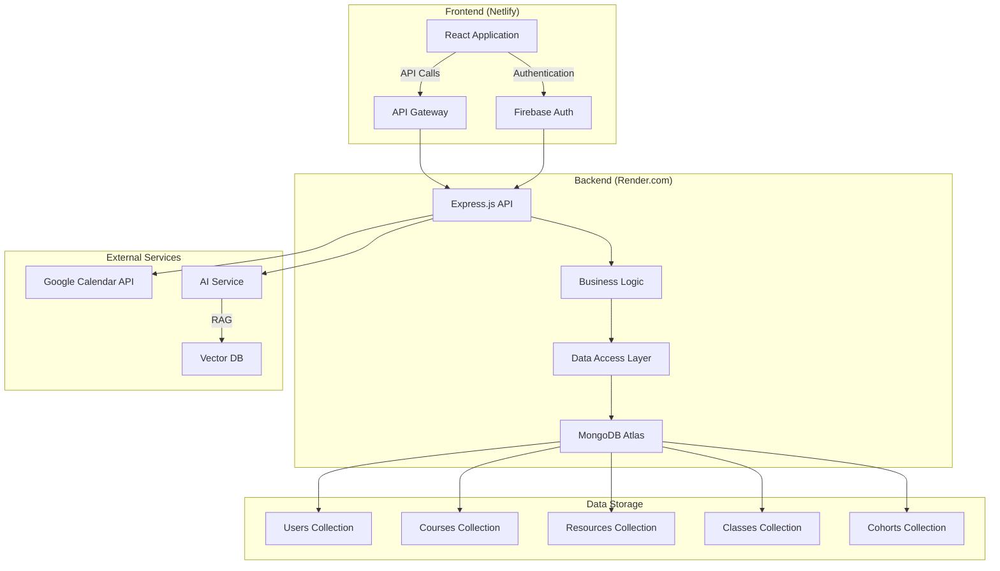
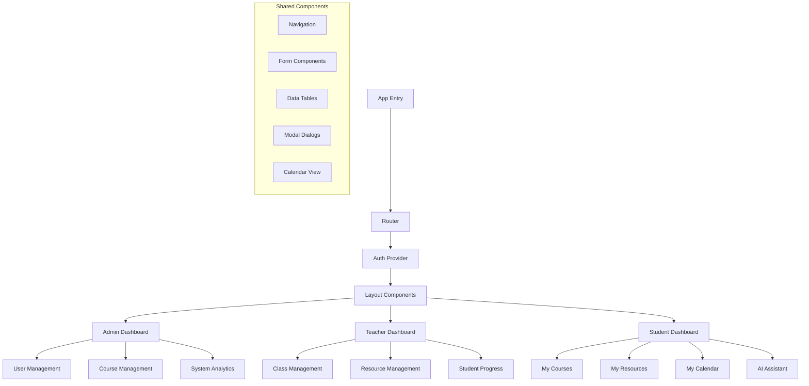
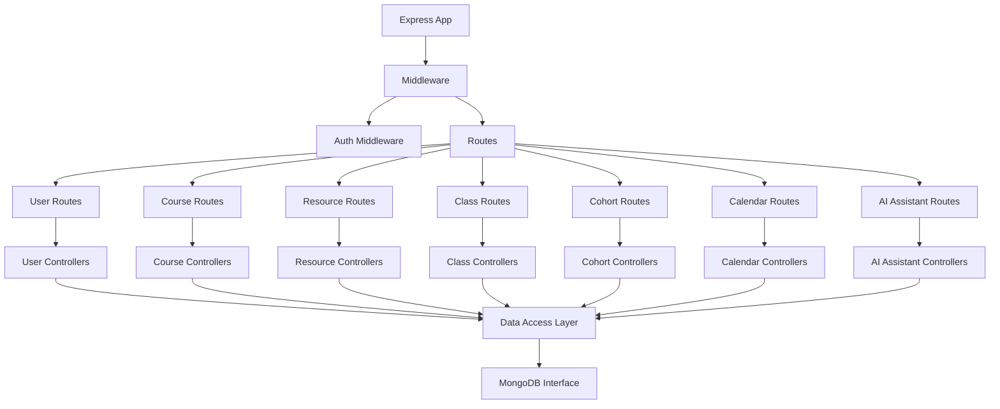
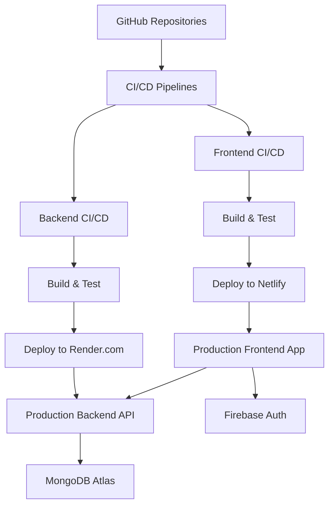
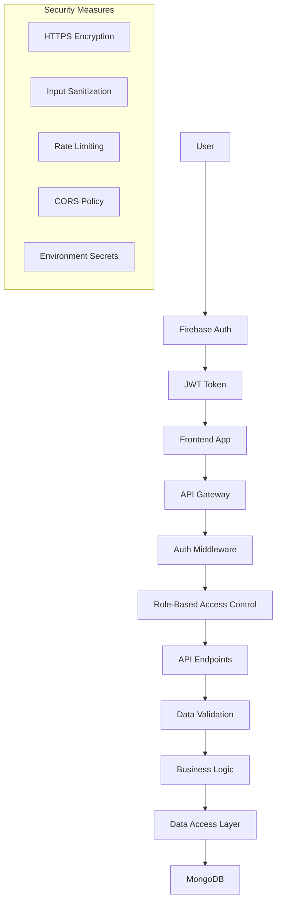
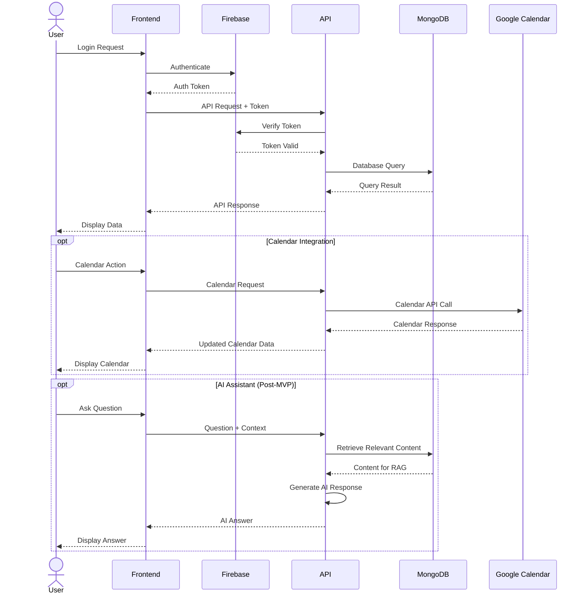

# System Architecture - simple-lms

## Overview

simple-lms is built on a modern stack with a clear separation of concerns between frontend and backend components. The system uses a distributed architecture with separate repositories for documentation, backend API, and frontend application.

## Architecture Diagram



## Component Architecture

### Frontend Architecture



### Backend Architecture



### Database Schema

```mermaid
erDiagram
    USER {
        string id PK
        string firebaseId
        string email
        string name
        enum role
        date createdAt
        date updatedAt
    }
    
    COURSE {
        string id PK
        string title
        string description
        array resources
        array classes
        date createdAt
        date updatedAt
    }
    
    RESOURCE {
        string id PK
        string title
        string description
        string type
        string url
        date createdAt
        date updatedAt
    }
    
    CLASS {
        string id PK
        string title
        string description
        string courseId FK
        date scheduledDate
        array resources
        date createdAt
        date updatedAt
    }
    
    COHORT {
        string id PK
        string name
        string description
        array studentIds
        array courseIds
        date startDate
        date endDate
        date createdAt
        date updatedAt
    }
    
    CALENDAR_EVENT {
        string id PK
        string title
        string description
        date startTime
        date endTime
        string googleCalendarId
        enum eventType
        string referenceId
        date createdAt
        date updatedAt
    }

    USER ||--o{ COHORT : "assigned to"
    COHORT ||--o{ COURSE : "includes"
    COURSE ||--o{ CLASS : "contains"
    COURSE ||--o{ RESOURCE : "has"
    CLASS ||--o{ RESOURCE : "uses"
    CLASS ||--o{ CALENDAR_EVENT : "scheduled as"
```

## Technology Stack

### Frontend
- **Framework**: React with Vite
- **Language**: TypeScript
- **Styling**: Tailwind CSS 4
- **State Management**: React Context API
- **Routing**: React Router
- **Authentication**: Firebase Auth Client SDK
- **HTTP Client**: Axios
- **Testing**: Jest + React Testing Library
- **Hosting**: Netlify

### Backend
- **Runtime**: Node.js
- **Framework**: Express.js
- **Language**: TypeScript
- **Database**: MongoDB with Mongoose ODM
- **Authentication**: Firebase Admin SDK
- **API Documentation**: Swagger/OpenAPI
- **Testing**: Jest + Supertest
- **Hosting**: Render.com

### External Services
- **Authentication**: Firebase Authentication
- **Calendar Integration**: Google Calendar API
- **AI Assistant**: (Post-MVP) Vector Database + LLM Service

## Repository Structure

### Documentation Repository (simple-lms-docs)

```
simple-lms-docs/
├── README.md
├── PRD.md
├── ARCHITECTURE.md
├── ELEVATOR-PITCH.md
├── EXECUTIVE-SUMMARY.md
├── TECHNICAL-SUMMARY.md
├── MARKET-RESEARCH.md
├── PLAN.md
├── TASKS.md
└── assets/
    └── diagrams/
```

### Backend Repository (simple-lms-be)

```
simple-lms-be/
├── README.md
├── src/
│   ├── config/
│   ├── controllers/
│   ├── models/
│   ├── routes/
│   ├── middleware/
│   ├── services/
│   ├── utils/
│   └── index.ts
├── tests/
├── package.json
├── tsconfig.json
└── .env.example
```

### Frontend Repository (simple-lms-fe)

```
simple-lms-fe/
├── README.md
├── src/
│   ├── assets/
│   ├── components/
│   │   ├── common/
│   │   ├── admin/
│   │   ├── teacher/
│   │   └── student/
│   ├── contexts/
│   ├── hooks/
│   ├── pages/
│   ├── services/
│   ├── types/
│   ├── utils/
│   ├── App.tsx
│   └── main.tsx
├── public/
├── index.html
├── vite.config.ts
├── package.json
├── tsconfig.json
└── tailwind.config.js
```

## Deployment Architecture



## Security Architecture



## Data Flow Architecture



## Resilience and Scaling

The architecture is designed to be resilient and scalable:

1. **Horizontal Scaling**: Both frontend and backend can be scaled horizontally
2. **Database Scaling**: MongoDB Atlas provides automated scaling options
3. **Caching**: Implement strategic caching for frequently accessed data
4. **Error Handling**: Comprehensive error handling and retry mechanisms
5. **Monitoring**: Integration with monitoring tools for performance tracking
6. **Backup**: Regular automated backups of database content

## Future Architectural Considerations

1. **Microservices**: Potential to break down the monolithic backend into microservices
2. **Container Orchestration**: Kubernetes for more complex deployment needs
3. **Event-Driven Architecture**: Implement message queues for asynchronous processing
4. **Edge Caching**: CDN integration for global performance improvements
5. **Advanced AI Features**: Dedicated AI infrastructure for the assistant feature
